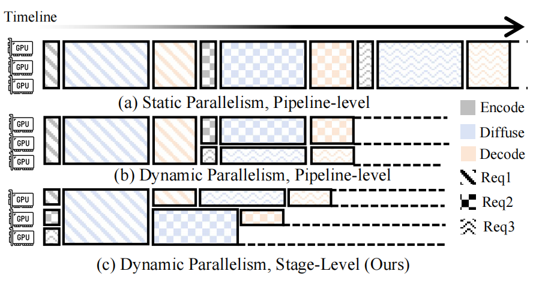

# Hetu-DiT

<p align="center">
   
</p>

<p align="center">
   <a href="https://arxiv.org/abs/2510.02838">
      
   </a>
</p>

## Overview
Hetu-DiT is a stage-level, dynamically parallel serving system for Diffusion Transformers (DiTs).

Real-world DiT workloads present two kinds of variability: request-level diversity (different prompt lengths, resolutions, or frame counts) and stage-level skew within each request (distinct compute intensity for condition encoding, denoising, VAE decode, and more). Static parallelism leaves GPUs under-utilized and introduces unnecessary latency.
As illustrated in Figure&nbsp;1, requests may exhibit different GPU demands for the diffuse stage (3, 2, and 1 GPU-equivalents for Req1, Req2, and Req3 respectively) while encoding and decoding stages remain lightweight and only need 1 GPU. A static pipeline-level schedule therefore leaves devices idle or creates long queues when downstream stages cannot keep up.

<p align="center">
   
   <br />
   <em>Figure 1. Comparison of static pipeline-level parallelism, dynamic pipeline-level parallelism, and our dynamic stage-level parallelism.</em>
</p>

Hetu-DiT profiles each stage, learns the stage-specific scalability, and rewrites execution plans on the fly so every request stage receives an appropriate batch size together with tailored parallelism degree and strategy (SP, CP, TP, PP).

## Installation

```bash
# Clone the repository
git clone https://github.com/PKU-DAIR/Hetu-DiT.git
cd Hetu-DiT

# Create and activate a dedicated environment (Python 3.10.16)
conda create -n hetu-dit python=3.10.16 -y
conda activate hetu-dit

# Install PyTorch with CUDA 12.4 support
conda install pytorch==2.5.1 torchvision torchaudio pytorch-cuda=12.4 -c pytorch -c nvidia -y

# (Optional) FlashAttention
pip install flash-attn==2.6.3

# Install Hetu-DiT and requirements
pip install -e .
```

## Usage

1. **Start a serving job:** Pick the script that matches the model you want to serve. For multi-node experiments, adjust `--machine_nums` in the scripts.

   ```bash
   cd scripts
   # Stable Diffusion 3
   bash launch_server_sd3.sh

   # CogVideoX 1.5-5B
   bash launch_server_cog.sh

   # Flux
   bash launch_server_flux.sh

   # HunyuanVideo
   bash launch_server_hunyuanvideo.sh
   ```

2. **Send requests or run benchmarks:**

   ```bash
   # Batch benchmark (choose the script that matches the server)
   bash launch_benchmark_sd3.sh
   ```

3. **Inspect outputs:** All results are written to the `results/` directory under `scripts/`.

### Runtime flags

- `--profile-on-startup`: Run the profiler once before serving traffic. The profiler replays synthetic workloads and records the optimal batch size plus parallelism strategy for every request.
- `--profile-repeat`: Number of iterations per profiled configuration (default `1`). Increase this if measurements are noisy.
- `--machine_nums`: Total number of nodes to register in the Ray cluster. Hetu-DiT will map executors across nodes accordingly.
- `--stage_level`: Enable stage-level scheduling inside a request. When set, Hetu-DiT can use different parallelism strategies across stages within a single request.
- `--adjust_strategy`: Controls parameter migration when switching parallelism. Available options:
   - `base`: Full parameter reload on every switch.
   - `cache`: Transfer only the minimal tensor slices via NCCL using cache-granularity bookkeeping.
   - `p2p`: Build on `cache` but moves slices with NIXL peer-to-peer streams to minimize latency.
- `--search-mode`: Choose the worker-instance search algorithm.
   - `random`: Select idle workers uniformly at random.
   - `multi_machine_efficient_ilp`: Solve a lightweight ILP to reduce parameter movement across nodes.
- `--scheduler-strategy`: Pick the request queueing policy.
   - `random`: Follow a FIFO discipline.
   - `multi_machine_efficient_ilp`: Pair with the ILP search mode for high SLO attainment and consistent latency.

## Performance Overview

Benchmarks were executed using the trace workloads in `data/` on a 128×NVIDIA L20 cluster. Some results below report SLO attainment, mean latency, and p95 latency.

| Model (steps) | Metric | xDiT (Static, Pipeline-Level) | Hetu-DiT (Dynamic, Stage-Level) |
| --- | --- | --- | --- |
| SD3 (20 steps) | SLO attainment | 0.24 | **0.95** |
|  | Mean latency (s) | 36 | **10** |
|  | P95 latency (s) | 99 | **28** |
| CogVideoX 1.5-5B (6 steps) | SLO attainment | 0.15 | **0.86** |
|  | Mean latency (s) | 320 | **78** |
|  | P95 latency (s) | 550 | **230** |

## References

```bibtex
@misc{xia2025tridentservestagelevelservingdiffusion,
  title         = {TridentServe: A Stage-level Serving System for Diffusion Pipelines},
  author        = {Yifei Xia and Fangcheng Fu and Hao Yuan and Hanke Zhang and Xupeng Miao and Yijun Liu and Suhan Ling and Jie Jiang and Bin Cui},
  year          = {2025},
  eprint        = {2510.02838},
  archivePrefix = {arXiv},
  primaryClass  = {cs.DC},
  url           = {https://arxiv.org/abs/2510.02838}
}
```

## Acknowledgements

This project draws inspiration from the open-source communities behind [xDiT](https://github.com/xdit-project/xDiT) and [vLLM](https://github.com/vllm-project/vllm). We appreciate their pioneering work on diffusion models and large language model inference and serving systems.
